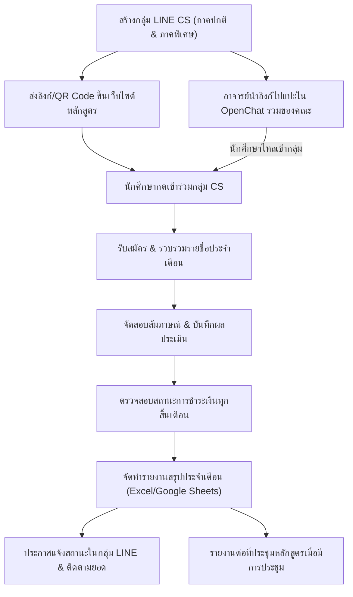

# 📘 คู่มือขั้นตอนการปฏิบัติงานมาตรฐาน (SOP)
## การรับสมัครและสัมภาษณ์นักศึกษาใหม่ (ระบบรับตรงประจำเดือน - Non-TCAS)
**หลักสูตรวิทยาการคอมพิวเตอร์**

[-orange.svg)](#)
[](#)
[](#)

เอกสารนี้จัดทำขึ้นเพื่อเป็น **SOP (Standard Operating Procedure)** สำหรับอาจารย์ผู้รับผิดชอบงานรับสมัครนักศึกษา และเจ้าหน้าที่ประสานงานหลักสูตร ในการดำเนินงานรับสมัคร สัมภาษณ์ ติดตามสถานะการชำระเงิน และบริหารจัดการช่องทางการสื่อสารนักศึกษาใหม่ตลอดทั้งปีการศึกษา

---

## 📌 ข้อมูลทั่วไปและรูปแบบการรับสมัคร

- **รูปแบบการรับสมัคร**: รับตรงโดยหลักสูตรตลอดทั้งปี (ไม่ผ่านระบบ TCAS)
- **วงรอบการดำเนินงาน**: จัดการสอบสัมภาษณ์และประมวลผล **ทุกเดือน**
- **กลุ่มหลักสูตร/แผนการเรียน**:
  1. **ภาคปกติ (จันทร์ - ศุกร์)**
  2. **ภาคพิเศษ (เสาร์ - อาทิตย์)**
- **ช่องทางสื่อสารหลัก**:
  - กลุ่ม LINE OpenChat ของหลักสูตร แยกตามปีการศึกษาและแผนการเรียน (ภาคปกติ และ ภาคพิเศษ)
  - หน้าเว็บไซต์รับสมัครของหลักสูตร
  - **LINE OpenChat รวมระดับคณะ**: คณะมีกลุ่ม OpenChat รวมที่รวบรวมนักศึกษาที่สมัครทุกคนไว้ ให้อาจารย์เข้าไปแปะลิงก์กลุ่ม LINE ของหลักสูตร เพื่อให้นักศึกษากดลิงก์และไหลเข้าสู่กลุ่มวิทยาการคอมพิวเตอร์โดยตรง

---

## 🗓️ ไทม์ไลน์วงรอบการปฏิบัติงานประจำเดือน (Monthly Routine Checklist)

| ช่วงเวลา | กิจกรรมที่ต้องดำเนินการ | ผู้รับผิดชอบ |
|---|---|---|
| **ตลอดเดือน / สัปดาห์ที่ 1 - 2** | • เข้าไปแปะลิงก์/ประชาสัมพันธ์กลุ่ม LINE ของหลักสูตรใน OpenChat รวมของคณะ เพื่อดึงนักศึกษาให้ไหลเข้ากลุ่ม CS<br>• ดึงรายชื่อผู้ยื่นใบสมัครใหม่จากระบบ/แบบฟอร์มรับสมัคร<br>• ตรวจสอบคุณสมบัติพื้นฐานและจัดคิวสัมภาษณ์ | เจ้าหน้าที่ / อาจารย์ผู้รับผิดชอบ |
| **สัปดาห์ที่ 3 ของเดือน** | • ดำเนินการสอบสัมภาษณ์ (Online ผ่าน Zoom/Meet หรือ On-site)<br>• บันทึกผลการประเมินลงในแบบฟอร์มสัมภาษณ์ | กรรมการสัมภาษณ์ |
| **ก่อนสิ้นเดือน (3-5 วัน)** | • ตรวจสอบสถานะการชำระเงินค่าธรรมเนียม/ค่ายืนยันสิทธิ์กับฝ่ายการเงิน<br>• จัดทำตารางสรุปผลประจำเดือนใน Excel หรือ Google Sheets (ผ่านสัมภาษณ์ / ชำระแล้ว / รอชำระ) | อาจารย์ผู้รับผิดชอบ |
| **วันสิ้นเดือน (Last Day)** | • ประกาศแจ้งสถานะและแจ้งเตือนการชำระเงินในกลุ่ม LINE ของหลักสูตร<br>• **เข้าไปแปะลิงก์กลุ่ม LINE ของหลักสูตรใน OpenChat รวมของคณะ** (เพื่อดึงผู้สมัครใหม่ให้ไหลเข้ากลุ่ม CS ประจำทุกสิ้นเดือน)<br>• รวบรวมข้อมูลสรุปยอดสะสมและจัดเตรียมรายงาน | อาจารย์ผู้รับผิดชอบ / เจ้าหน้าที่ |
| **เมื่อมีการประชุมหลักสูตร** | • นำเสนอรายงานสรุปยอดผู้สมัคร ผู้ผ่านสัมภาษณ์ และสถานะการชำระเงินยืนยันสิทธิ์สะสมต่อที่ประชุมหลักสูตร เพื่อพิจารณาและรับทราบ | อาจารย์ผู้รับผิดชอบ |

---

## 📋 ขั้นตอนการปฏิบัติงานมาตรฐาน (Step-by-Step SOP)



### ขั้นตอนที่ 1: การเตรียมการก่อนเปิดรับสมัครประจำปี (Annual Setup)
*(ดำเนินการปีละ 1 ครั้ง ก่อนเริ่มเปิดรับสมัครรุ่นใหม่)*

1. **สร้างกลุ่ม LINE OpenChat ประจำปีการศึกษาใหม่** โดยแยกเป็น 2 กลุ่มอย่างชัดเจน:
   - ภาคปกติ: `CS [ปีการศึกษา] - ภาคปกติ (จันทร์-ศุกร์)`
   - ภาคพิเศษ: `CS [ปีการศึกษา] - ภาคพิเศษ (เสาร์-อาทิตย์)`
   > **ข้อแนะนำการตั้งค่า LINE OpenChat**:
   > - กำหนดเงื่อนไขการเข้ากลุ่ม เช่น ให้ตั้งชื่อโปรไฟล์เป็น `ชื่อจริง - นามสกุล (ผู้สมัคร)`
   > - ปักหมุด (Pin) โน้ตแจ้งรายละเอียดหลักสูตร ช่องทางการชำระเงิน และระเบียบการสำคัญไว้ในกลุ่ม
2. **ส่งลิงก์และ QR Code ขึ้นเว็บไซต์หลักสูตร**:
   - ส่งข้อมูลลิงก์กลุ่มและรูป QR Code ให้ผู้ดูแลเว็บไซต์หลักสูตรเพื่ออัปเดตลงบนหน้าเพจรับสมัคร
   - ตรวจสอบความถูกต้องของลิงก์เพื่อให้ผู้สมัครสามารถกดเข้าร่วมได้ทันทีหลังสมัคร
3. **นำลิงก์ไปแปะใน LINE OpenChat รวมระดับคณะ (ต้องทำทุกสิ้นเดือนเช่นกัน)**:
   - ทางคณะจะมีกลุ่ม LINE OpenChat รวม ซึ่งนักศึกษาที่สมัครทุกคนในคณะจะรวมตัวอยู่ในกลุ่มนี้
   - ให้อาจารย์ผู้รับผิดชอบงานรับสมัคร เข้าร่วมกลุ่ม OpenChat ของคณะ และนำลิงก์/QR Code กลุ่ม LINE ของหลักสูตรวิทยาการคอมพิวเตอร์ (ทั้งภาคปกติและภาคพิเศษ) ไปโพสต์/แปะประชาสัมพันธ์
   - **สำคัญมาก**: การแปะลิงก์ใน OpenChat รวมของคณะนี้ **จะต้องดำเนินการเป็นประจำทุกสิ้นเดือนเช่นกัน** เพื่อให้ผู้สมัครรอบใหม่ที่เพิ่งสมัครเข้ามาในแต่ละเดือนสามารถกดลิงก์และ **ไหลเข้าสู่กลุ่ม LINE ของหลักสูตร** ได้อย่างต่อเนื่อง เพื่อเตรียมนัดสัมภาษณ์ในรอบถัดไป

---

### ขั้นตอนที่ 2: วงรอบการสัมภาษณ์ประจำเดือน (Monthly Interview)

1. **รวบรวมรายชื่อผู้สมัคร**:
   - นำไฟล์รายชื่อผู้สมัครในรอบเดือนนั้นมาบันทึกลงใน `admissions/data/raw/monthly_applicants/`
   - จำแนกผู้สมัครตามกลุ่ม (ภาคปกติ / เสาร์-อาทิตย์)
2. **เตรียมนัดหมายและส่งลิงก์สัมภาษณ์**:
   - ส่งอีเมลหรือข้อความนัดหมายวัน เวลา และห้องสัมภาษณ์ (Zoom/Google Meet หรือห้องเรียน)
   - แนบลิงก์กลุ่ม LINE ของรุ่นให้ผู้สมัครที่ยังไม่ได้เข้าร่วม
3. **ดำเนินการสัมภาษณ์และบันทึกผล**:
   - กรรมการกรอกผลการประเมินลงในแบบฟอร์มสัมภาษณ์
   - บันทึกมติ: **ผ่านการคัดเลือก (Passed)** / **ไม่ผ่านการคัดเลือก (Failed)** / **รอพิจารณาเพิ่มเติม (Pending)**

---

### ขั้นตอนที่ 3: สรุปผลและตรวจสอบการชำระเงินทุกสิ้นเดือน (End-of-Month Consolidation)

1. **ประสานงานฝ่ายการเงิน / ตรวจสอบสลิปโอนเงิน**:
   - ดึงข้อมูลยอดการชำระเงินค่ายืนยันสิทธิ์หรือค่าลงทะเบียนเรียนจากระบบมหาวิทยาลัย ผ่าน [https://ent.vru.ac.th](https://ent.vru.ac.th)
   - ตรวจสอบความถูกต้องของหลักฐานการชำระเงิน
2. **จัดทำตารางสรุปสถานะประจำเดือนใน Excel หรือ Google Sheets**:
   - จัดทำและอัปเดตข้อมูลสรุปรายชื่อผู้ผ่านสัมภาษณ์ลงใน **Microsoft Excel (`.xlsx`) หรือ Google Sheets** เพื่อให้ทีมงานและคณะกรรมการเข้าถึงและทำงานร่วมกันได้สะดวก
   - บันทึกสถานะผู้ผ่านสัมภาษณ์แต่ละราย โดยจำแนกออกเป็น:
     - `ชำระเงินเรียบร้อย (Confirmed & Paid)`
     - `รอชำระเงิน (Pending Payment)` (ระบุวันครบกำหนดชำระ)
     - `สละสิทธิ์ (Declined)`
   - กรณีใช้ไฟล์ Excel ให้จัดเก็บไว้ใน `admissions/reports/monthly_summaries/summary_YYYY_MM.xlsx` หรือหากใช้ Google Sheets ให้แชร์สิทธิ์การเข้าถึงแก่ประธานหลักสูตรและทีมงานที่เกี่ยวข้อง

---

### ขั้นตอนที่ 4: การประกาศผลในกลุ่ม LINE และการรายงานต่อหลักสูตร (Announcement & Reporting)

1. **ส่งข้อความประกาศสรุปสถานะในกลุ่ม LINE ประจำเดือน**:
   - ประกาศรายชื่อผู้ผ่านสัมภาษณ์ประจำเดือน (เซนเซอร์ข้อมูลส่วนบุคคล เช่น นามสกุลบางส่วน ตาม PDPA)
   - แจ้งเตือนยอดผู้ที่สถานะ "รอชำระเงิน" พร้อมย้ำกำหนดวันสุดท้ายของการชำระเงิน
   - แนะนำขั้นตอนถัดไปสำหรับผู้ที่ชำระเงินแล้ว (เช่น การทำบัตรนักศึกษา, กำหนดการปฐมนิเทศ)
2. **รายงานต่อที่ประชุมหลักสูตรเมื่อมีการประชุม**:
   - นำข้อมูลสถิติและสถานะการรับสมัครเข้าเป็นวาระรายงานต่อที่ประชุมคณะกรรมการบริหารหลักสูตรเมื่อมีการประชุม
   - ประเด็นสำคัญที่ต้องรายงาน:
     - จำนวนผู้สมัครและผู้ผ่านการสอบสัมภาษณ์ในรอบเดือนล่าสุด
     - ยอดผู้ชำระเงินยืนยันสิทธิ์จริงสะสม (แยกภาคปกติ จ.-ศ. และภาคพิเศษ ส.-อา.)
     - สรุปเทียบกับเป้าหมายการรับตามแผนหลักสูตร เพื่อให้ที่ประชุมพิจารณาแนวทางหรือแผนการรับสมัครในรอบถัดไป
3. **แปะลิงก์กลุ่ม LINE ใน OpenChat รวมของคณะ (Routine ประจำทุกสิ้นเดือน)**:
   - ทุกสิ้นเดือน นอกจากการประกาศผลและสรุปยอดแล้ว ให้อาจารย์นำลิงก์/QR Code ของกลุ่ม LINE หลักสูตร (ทั้งภาคปกติและภาคพิเศษ) ไปโพสต์ประชาสัมพันธ์ในกลุ่ม OpenChat รวมของคณะอีกครั้ง
   - เพื่อดึงกลุ่มผู้สมัครใหม่ที่เพิ่งยื่นใบสมัครเข้ามา ให้กดเข้าร่วมและไหลเข้ากลุ่มหลักสูตรวิทยาการคอมพิวเตอร์สำหรับรอบเดือนถัดไป

---

## 📂 เอกสารอ้างอิงและตัวอย่างประกาศ (Reference)

ดูรูปแบบและตัวอย่างการประกาศรายชื่อผู้ผ่านสัมภาษณ์พร้อมสถานะการชำระเงินได้ที่:
- โฟลเดอร์: [admissions/reference/](file:///e:/chavalit/colab/cs-office/admissions/reference)

---

## 📁 โครงสร้างไฟล์ในโฟลเดอร์ `admissions/`

```text
admissions/
├── reference/                        # ไฟล์ตัวอย่างประกาศรายชื่อและเอกสารอ้างอิง
├── data/
│   ├── raw/
│   │   ├── monthly_applicants/       # ไฟล์รายชื่อผู้สมัครในแต่ละเดือน
│   │   └── payment_proofs/           # หลักฐานการชำระเงิน
│   └── processed/                    # ข้อมูลสรุปยอดสะสมนักศึกษาใหม่
├── reports/
│   └── monthly_summaries/            # รายงานสรุปสถานะส่งผู้บริหารทุกสิ้นเดือน (Excel / Google Sheets)
└── README.md                         # คู่มือขั้นตอนการปฏิบัติงาน (SOP)
```

---

## ⚠️ ข้อควรระวังและแนวทางปฏิบัติที่สำคัญ (Important Notes)

> [!IMPORTANT]
> 1. **การรักษาความลับข้อมูลนักศึกษา (PDPA)**: การประกาศรายชื่อในกลุ่ม LINE ต้องไม่เปิดเผยเลขบัตรประชาชน เบอร์โทรศัพท์ หรือที่อยู่ของผู้สมัครโดยเด็ดขาด
> 2. **การคุมยอดรับให้เป็นไปตามแผนหลักสูตร**: ติดตามยอดผู้ชำระเงินของภาคปกติและภาคพิเศษอย่างใกล้ชิด หากกลุ่มใดมียอดชำระครบตามจำนวนที่ สป.อว. กำหนด ให้แจ้งอาจารย์ผู้รับผิดชอบทันทีเพื่อพิจารณาปิดรับสมัครหรือเปิดเป็นที่นั่งสำรอง
> 3. **การส่งต่อเวรงาน**: เมื่อมีการเปลี่ยนอาจารย์ผู้ดูแล ให้ส่งมอบสิทธิ์ Admin ของกลุ่ม LINE OpenChat และส่งมอบสิทธิ์เข้าถึงโฟลเดอร์เอกสารนี้ทุกครั้ง
