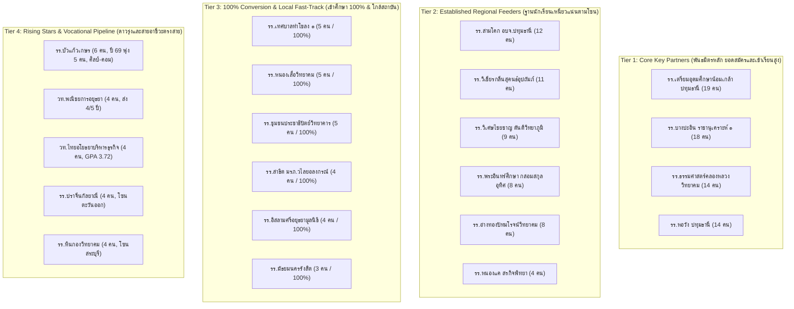
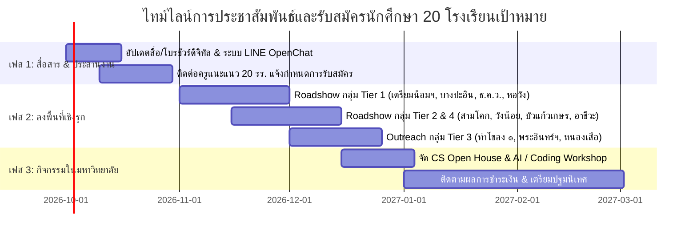

# 📊 รายงานการวิเคราะห์ข้อมูลการรับสมัครนักศึกษา 5 ปี (ปีการศึกษา 2565 – 2569)
## สรุป 20 โรงเรียนเป้าหมายหลักสำหรับการประชาสัมพันธ์เชิงรุก
**หลักสูตรวิทยาการคอมพิวเตอร์ (วท.บ.)**

[-green.svg)](#)

---

## Executive Summary (บทสรุปสำหรับผู้บริหาร)

รายงานฉบับนี้จัดทำขึ้นจากการประมวลผลและวิเคราะห์ข้อมูลสถิติการรับสมัครนักศึกษาใหม่หลักสูตรวิทยาการคอมพิวเตอร์ ย้อนหลัง 5 ปีการศึกษา (2565 – 2569) จากฐานข้อมูล [Admissiom.xlsx](file:///e:/chavalit/colab/cs-office/admissions/analysis/Admissiom.xlsx) ซึ่งมีข้อมูลผู้สมัครรวมทั้งสิ้น **407 คน** จากโรงเรียนและสถาบันการศึกษาทั่วประเทศรวม **256 แห่ง**

### ประเด็นสำคัญจากการวิเคราะห์ 5 ปี (Key Insights)
1. **โซนพื้นที่เป้าหมายหลัก (Geographic Cluster):** ผู้สมัครกว่า 75% อยู่ใน 2 จังหวัดหลัก ได้แก่ **จังหวัดปทุมธานี (52%)** และ **จังหวัดพระนครศรีอยุธยา (23%)** ตามมาด้วย **อ่างทอง (8%)**, **สระบุรี (5%)**, **กรุงเทพฯ (3.5%)** และจังหวัดในภาคกลาง/ตะวันออก
2. **ความภักดีและความต่อเนื่องของเครือข่ายโรงเรียน (Feeder Consistency):** มีกลุ่มโรงเรียนมัธยมพันธมิตรที่ส่งนักเรียนสมัครต่อเนื่องครบทั้ง 5 ปีการศึกษา ได้แก่ *รร.บางปะอิน "ราชานุเคราะห์ ๑"*, *รร.ธรรมศาสตร์คลองหลวงวิทยาคม* และ *รร.หอวัง ปทุมธานี*
3. **กลุ่มอัตราการเข้าศึกษาจริง 100% (100% Conversion Feeders):** พบโรงเรียนที่มีอัตราการยืนยันสิทธิ์และเข้าศึกษาจริง 100% เต็ม ได้แก่ *รร.หนองเสือวิทยาคม*, *รร.ชุมชนประชาธิปัตย์วิทยาคาร*, *รร.เทศบาลท่าโขลง ๑*, *รร.สาธิต มรภ.วไลยอลงกรณ์*, *รร.อิสลามศรีอยุธยามูลนิธิ* และ *รร.มัธยมนครรังสิต*
4. **การเติบโตก้าวกระโดดของสายคอมพิวเตอร์และอาชีวศึกษา (Vocational & IT Fit):** นักเรียนจากสาย *ศิลป์-คอมพิวเตอร์*, *คอมพิวเตอร์ธุรกิจ*, *เทคโนโลยีธุรกิจดิจิทัล* และ *คอมพิวเตอร์กราฟิก* จากโรงเรียนอย่าง *รร.สามโคก*, *รร.บัวแก้วเกษร*, *รร.วิเชียรกลิ่นสุคนธ์ฯ*, *วท.พณิชยการอยุธยา* และ *วท.ไทยอโยธยาฯ* มีอัตราการเลือกเรียนต่อในสาขาวิทยาการคอมพิวเตอร์สูงมาก

---

## 1. ตารางเมทริกซ์ 20 โรงเรียนเป้าหมายหลัก (Top 20 Target Schools Matrix)

> [!TIP]
> เกณฑ์การคัดเลือกและจัดลำดับใช้ **Multi-Criteria Scoring** ประกอบด้วย:
> - **Volume (30%)**: จำนวนผู้สมัครสะสมตลอด 5 ปี (2565 – 2569)
> - **Consistency (25%)**: ความต่อเนื่องในการส่งนักเรียน (Active Years จาก 5 ปี)
> - **Recent Momentum (20%)**: จำนวนผู้สมัครใน 2 ปีล่าสุด (ปีการศึกษา 2568 – 2569)
> - **Conversion Rate (15%)**: อัตราการยืนยันสิทธิ์/ชำระค่าเทอมเข้าศึกษาจริง
> - **Proximity & Curriculum Fit (10%)**: ความใกล้เคียงทางภูมิศาสตร์และการมีแผนการเรียนคอมพิวเตอร์/เทคโนโลยี

| อันดับ | ชื่อโรงเรียน / สถาบัน | จังหวัด | ยอดสมัคร 5 ปี | ความต่อเนื่อง | สถิติรายปี (65→69) | 2 ปีล่าสุด (68-69) | ยืนยันสิทธิ์/เข้าศึกษา | GPA เฉลี่ย | แผนการเรียนเด่น |
| :---: | :---| :---: | :---: | :---: | :---: | :---: | :---: | :---: | :---|
| **1** | **โรงเรียนเตรียมอุดมศึกษาน้อมเกล้า ปทุมธานี** | ปทุมธานี | **19 คน** | 3/5 ปี | 0 - 0 - 15 - 1 - 3 | 4 คน | 15 คน (**78.9%**) | 3.15 | วิทย์-คณิต, ศิลป์-คำนวณ |
| **2** | **โรงเรียนบางปะอิน "ราชานุเคราะห์ ๑"** | พระนครศรีอยุธยา | **18 คน** | **5/5 ปี** | 8 - 2 - 2 - 1 - 5 | **6 คน** | 10 คน (**55.6%**) | 3.05 | วิทย์-คณิต, ศิลป์-จีน |
| **3** | **โรงเรียนธรรมศาสตร์คลองหลวงวิทยาคม** | ปทุมธานี | **14 คน** | **5/5 ปี** | 5 - 2 - 4 - 2 - 1 | 3 คน | 9 คน (**64.3%**) | 3.17 | วิทย์-คณิต, วิทยาการคอมฯ |
| **4** | **โรงเรียนหอวัง ปทุมธานี** | ปทุมธานี | **14 คน** | **5/5 ปี** | 2 - 4 - 5 - 1 - 2 | 3 คน | 8 คน (**57.1%**) | 3.15 | วิทย์-คณิต, วิทย์-คอม |
| **5** | **โรงเรียนสามโคก (อบจ.ปทุมธานี)** | ปทุมธานี | **12 คน** | 4/5 ปี | 0 - 1 - 2 - 7 - 2 | **9 คน** | 8 คน (**66.7%**) | 2.85 | คอมพิวเตอร์ธุรกิจ |
| **6** | **โรงเรียนวิเชียรกลิ่นสุคนธ์อุปถัมภ์** | พระนครศรีอยุธยา | **11 คน** | 4/5 ปี | 3 - 3 - 0 - 2 - 3 | **5 คน** | 7 คน (**63.6%**) | 3.12 | เทคโนโลยี/คอมกราฟิก |
| **7** | **โรงเรียนวิเศษไชยชาญ "ตันติวิทยาภูมิ"** | อ่างทอง | **9 คน** | 4/5 ปี | 3 - 2 - 0 - 2 - 2 | 4 คน | 5 คน (**55.6%**) | 2.63 | วิทย์-คณิต, วิทยาการคอมฯ |
| **8** | **โรงเรียนพระอินทร์ศึกษา (กล่อมสกุลอุทิศ)** | พระนครศรีอยุธยา | **8 คน** | 4/5 ปี | 1 - 0 - 2 - 1 - 4 | **5 คน** | 4 คน (**50.0%**) | 3.32 | เทคโนโลยีและคอมพิวเตอร์ |
| **9** | **โรงเรียนอ่างทองปัทมโรจน์วิทยาคม** | อ่างทอง | **8 คน** | 4/5 ปี | 0 - 1 - 2 - 1 - 4 | **5 คน** | 2 คน (**25.0%**) | 3.24 | วิทย์-คณิต (Genius) |
| **10** | **โรงเรียนบัวแก้วเกษร** | ปทุมธานี | **6 คน** | 2/5 ปี | 0 - 0 - 0 - 1 - 5 | **6 คน** | 4 คน (**66.7%**) | **3.40** | ศิลป์-คอมพิวเตอร์ |
| **11** | **โรงเรียนหนองเสือวิทยาคม** | ปทุมธานี | **5 คน** | 3/5 ปี | 0 - 0 - 1 - 3 - 1 | 4 คน | 5 คน (**100.0%**) | 3.18 | ศิลป์ทั่วไป, วิทย์-คณิต |
| **12** | **โรงเรียนชุมชนประชาธิปัตย์วิทยาคาร** | ปทุมธานี | **5 คน** | 3/5 ปี | 0 - 0 - 2 - 2 - 1 | 3 คน | 5 คน (**100.0%**) | 2.80 | วิทย์-คณิต, ศิลป์-คำนวณ |
| **13** | **โรงเรียนเทศบาลท่าโขลง ๑** | ปทุมธานี | **5 คน** | 2/5 ปี | 0 - 0 - 0 - 2 - 3 | **5 คน** | 5 คน (**100.0%**) | 2.91 | คอมพิวเตอร์, วิทย์กีฬา |
| **14** | **วิทยาลัยเทคโนโลยีพณิชยการอยุธยา** | พระนครศรีอยุธยา | **4 คน** | 4/5 ปี | 1 - 1 - 1 - 0 - 1 | 1 คน | 2 คน (**50.0%**) | 2.99 | การบัญชี, ธุรกิจดิจิทัล |
| **15** | **โรงเรียนสาธิต มรภ.วไลยอลงกรณ์** | ปทุมธานี | **4 คน** | 3/5 ปี | 0 - 1 - 0 - 2 - 1 | 3 คน | 4 คน (**100.0%**) | 3.06 | ศิลป์-คำนวณ, วิทย์-คณิต |
| **16** | **โรงเรียนปราจีนกัลยาณี** | ปราจีนบุรี | **4 คน** | 3/5 ปี | 1 - 0 - 1 - 0 - 2 | 2 คน | 1 คน (**25.0%**) | 2.31 | วิทย์-คณิต, ศิลป์ภาษา |
| **17** | **วิทยาลัยเทคโนโลยีไทยอโยธยาบริหารธุรกิจ** | พระนครศรีอยุธยา | **4 คน** | 3/5 ปี | 1 - 0 - 2 - 1 - 0 | 1 คน | 2 คน (**50.0%**) | **3.72** | คอมพิวเตอร์ธุรกิจ |
| **18** | **โรงเรียนหนองแค "สรกิจพิทยา"** | สระบุรี | **4 คน** | 3/5 ปี | 2 - 0 - 1 - 1 - 0 | 1 คน | 2 คน (**50.0%**) | 2.71 | ศิลป์-คำนวณ, สายศิลป์ |
| **19** | **โรงเรียนอิสลามศรีอยุธยามูลนิธิ** | พระนครศรีอยุธยา | **4 คน** | 2/5 ปี | 0 - 1 - 0 - 0 - 3 | 3 คน | 4 คน (**100.0%**) | 2.66 | อังกฤษ-คอมพิวเตอร์ |
| **20** | **โรงเรียนหินกองวิทยาคม** | สระบุรี | **4 คน** | 1/5 ปี | 0 - 0 - 4 - 0 - 0 | 0 คน | 2 คน (**50.0%**) | 3.03 | วิทย์-คณิต, ศิลปธุรกิจ |

*(หมายเหตุ: โรงเรียนสำรองอันดับ 21–25 ได้แก่ รร.อยุธยาวิทยาลัย, รร.เสนา "เสนาประสิทธิ์", รร.มัธยมนครรังสิต (เข้าศึกษา 100%), รร.องครักษ์, และ รร.ปทุมธานี นันทมุนีบำรุง)*

---

## 2. การจัดกลุ่มเชิงยุทธศาสตร์ 4 กลุ่ม (4 Strategic Tiers)

---

## 3. เจาะลึกจุดเด่นและแนวทางปฏิบัติการรายกลุ่ม (Strategic Action Plan)

### 📌 Tier 1: Core Key Partners (อันดับ 1 - 4)
- **ลักษณะเด่น:** เป็นโรงเรียนมัธยมขนาดใหญ่พิเศษ ส่งนักเรียนต่อเนื่องสะสมรวมมากกว่า 65 คน (คิดเป็น 16% ของยอดสมัครทั้งหมด)
- **กลยุทธ์:**
  1. จัดกิจกรรม **Roadshow สัญจรประจำปี** พร้อม Workshop การเขียนโปรแกรม/AI ณ โรงเรียน
  2. จัดทำ **โควตาความร่วมมือ (School Quota)** มอบสิทธิ์ตรงให้กับนักเรียนที่มีผลการเรียนดี
  3. แต่งตั้งอาจารย์ประจำหลักสูตรเป็นผู้ประสานงานหลัก (Key Account Manager) ดูแลครูแนะแนว

### 📌 Tier 2: Established Regional Feeders (อันดับ 5 - 9, 18)
- **ลักษณะเด่น:** เป็นศูนย์กลางการป้อนนักศึกษาจากโซนรายรอบ (สามโคก, วังน้อย, อ่างทอง, สระบุรี-หนองแค)
- **กลยุทธ์:**
  1. ประชาสัมพันธ์สิ่งอำนวยความสะดวก หอพัก และสวัสดิการของมหาวิทยาลัยเพื่อจูงใจนักเรียนต่างอำเภอ/ต่างจังหวัด
  2. จัดโครงการ **Campus Visit / Open House** พานักเรียนนั่งรถบัสมาสัมผัสบรรยากาศห้องปฏิบัติการจริง

### 📌 Tier 3: 100% Conversion & Local Champions (อันดับ 11 - 13, 15, 19, 23)
- **ลักษณะเด่น:** ทุกคนที่สมัครผ่านการคัดเลือกและ **ยืนยันสิทธิ์เข้าศึกษาจริง 100% เต็ม** ส่วนใหญ่อยู่ในพื้นที่ปทุมธานี-คลองหลวง-นวนคร
- **กลยุทธ์:**
  1. สร้าง **Fast-Track Admission** (ยื่นใบสมัคร สัมภาษณ์ และทราบผลทันที)
  2. ให้ทุนการศึกษาเริ่มต้น หรือส่วนลดค่าธรรมเนียมพิเศษสำหรับนักเรียนในเขตเทศบาล/ชุมชนรอบมหาวิทยาลัย

### 📌 Tier 4: Rising Stars & Vocational Pipeline (อันดับ 10, 14, 16, 17, 20)
- **ลักษณะเด่น:** โรงเรียนที่มีอัตราการเติบโตเด่นชัดในปีล่าสุด (เช่น รร.บัวแก้วเกษร ปี 69 สมัคร 5 คน) และกลุ่มวิทยาลัยอาชีวศึกษาที่มีสาขาคอมพิวเตอร์ธุรกิจ/ดิจิทัล
- **กลยุทธ์:**
  1. โครงการ **เทียบโอนหน่วยกิต (Credit Bank)** สำหรับนักเรียน ปวช./สายอาชีพ เพื่อลดระยะเวลาเรียน
  2. ส่งทีมรุ่นพี่ศิษย์เก่า (Alumni Ambassadors) ไปแนะแนวและถ่ายทอดประสบการณ์จริง

---

## 4. แผนงานการลงพื้นที่ตามวงรอบปฏิทินรับสมัคร (Recruitment Timeline)

---
*จัดทำรายงานโดย: ระบบวิเคราะห์ข้อมูลการรับสมัครนักศึกษา หลักสูตรวิทยาการคอมพิวเตอร์*  
*ไฟล์ข้อมูลต้นทาง: [Admissiom.xlsx](file:///e:/chavalit/colab/cs-office/admissions/analysis/Admissiom.xlsx)*  
*วันที่ประมวลผล: 20 กันยายน 2569*
